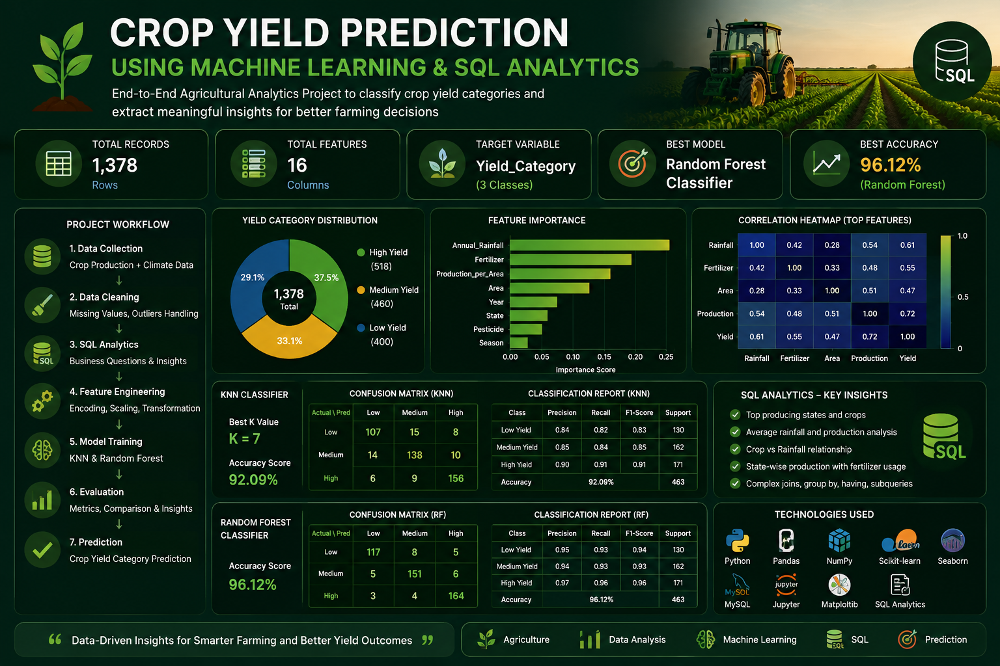

  

<h1 align="center">🌾 Crop Yield Prediction using Machine Learning & SQL</h1>

  A complete Data Science project combining agricultural data analysis, SQL, Machine Learning, and model evaluation.

  
  
  
  
  

---

## 📌 Project Overview

This project predicts agricultural crop yield categories using Machine Learning and SQL-based analysis.

The complete workflow includes:

- Data Cleaning
- Exploratory Data Analysis
- SQL Analysis
- Feature Engineering
- Model Training
- Model Evaluation
- Crop Yield Prediction

The model classifies crop yield into:

- Low Yield
- Medium Yield
- High Yield

---

## 🎯 Problem Statement

Agricultural production is influenced by factors such as climate, rainfall, crop type, soil conditions, location, and farming practices.

The goal of this project is to analyze agricultural data and build a Machine Learning model capable of predicting crop yield categories accurately.

---

## 📊 Dataset Information

- Total Records: **1,378**
- Total Features: **16**
- Target Variable: **Yield Category**
- Target Classes:
  - Low Yield
  - Medium Yield
  - High Yield

The project uses multiple agricultural datasets for data analysis and model development.

---

## 🛠️ Technologies Used

### Programming & Querying
- Python
- SQL

### Python Libraries
- Pandas
- NumPy
- Matplotlib
- Seaborn
- Scikit-learn

### Tools
- Jupyter Notebook
- Tableau
- Git
- GitHub

---

## ⭐ Project Features

- 📊 Exploratory Data Analysis (EDA)
- 🧹 Data Cleaning & Preprocessing
- 🤖 Machine Learning Classification
- 📈 Model Evaluation
- 🗄️ SQL Data Analysis
- 🌾 Crop Yield Prediction

---

## 🔄 Project Workflow

- 📥 Raw Agricultural Data
- 🧹 Data Cleaning
- 📊 Exploratory Data Analysis (EDA)
- ⚙️ Feature Engineering
- 🔄 Data Preprocessing
- 🤖 Model Training
- 📈 Model Evaluation
- 🌾 Crop Yield Prediction

---

## 🤖 Machine Learning Models

Two Machine Learning classification models were developed and evaluated to predict crop yield categories.

### 🌱 K-Nearest Neighbors (KNN)

- Used as the baseline classification model.
- Accuracy: **72%**

### 🌳 Random Forest Classifier

- Used as the final prediction model.
- Accuracy: **96.12%**

✅ Random Forest delivered significantly higher prediction accuracy and better overall performance, making it the final selected model for this project.

---

## 📊 Model Evaluation

The trained models were evaluated using:

- ✅ Accuracy Score
- ✅ Confusion Matrix
- ✅ Classification Report
- ✅ Precision
- ✅ Recall
- ✅ F1-Score

### 🏆 Final Model Performance

| Model | Accuracy |
|--------|----------|
| K-Nearest Neighbors | 72% |
| Random Forest | **96.12%** |

Random Forest outperformed KNN across all evaluation metrics.

## 📈 Results

The Random Forest model successfully classified crop yield into different categories with an overall accuracy of **96.12%**.

### Key Achievements

- ✅ Achieved 96.12% prediction accuracy
- ✅ Performed complete data preprocessing
- ✅ Conducted exploratory data analysis
- ✅ Compared multiple Machine Learning models
- ✅ Selected the best-performing model

---

## 🗄️ SQL Analysis

SQL was used to analyze the agricultural dataset and uncover important insights before building the Machine Learning model.

### SQL Queries Performed

- 🌾 Crop production by state
- 📊 Crop-wise production analysis
- 🌦️ Rainfall and production relationship
- 🌱 Fertilizer usage analysis
- 📈 High-yield crop identification
- 🗺️ Regional agricultural performance

These SQL analyses helped explore the dataset and supported the Machine Learning workflow.
